# FIFA '21 Analysis

## Introduction

Following the [cleaning](https://github.com/nwashilia/fifa-21-data-cleaning/blob/main/README.md) of the FIFA '21 dataset from the first edition of the #DataCleaningChallenge, I decided to look deeper into the data (it also became a completing part of the challenge) with perspectives and recommendations from a Manager's view.
This project was executed using MS Excel and aimed at analysing the dataset and provide insights which would enable any of the club managers easily hit the ground running with any club he picks to begin his managerial journey.

**_Disclaimer:_** _The dataset used for this analysis is based off of data for the game franchise FIFA '21. The data, though very closely related to the real life player's stats, is in no way a 100%, up to date reflection of the players' present day rankings._

## Problem Statement

This was a pretty tough analysis[sweatign emoji] to execute. I set out to answer the following questions initial questions:
1. What teams are the best rated teams in the world?
2. In the world, what teams are the best in the major team segments (Attack, Midfield and Defence)?
3. Are there undervalued players around the world and how can you make use of this if you do have these players?
4. Are there any strategies that you can suggest the managers use in team building?
5. When do players peak in their performance?
6. Who are the most valued players, top rated players and promising star in the world?
7. Is the team built with the next 5 years in mind?

I pushed further to answer some more intricate questions which include:
1. Question 1, 2, and 6 were answered again but with the various leagues in mind.
2. Where do the strengths and weaknesses of each team lie?
3. Can you suggest tactics, strategies and the likes which would be beneficial to the team?
4. What other means can you suggest that'll help the team increase revenue [emoji revenue up] or cut expenses [emoji revenue down]?

## Skills/Concepts Demonstrated

In the course of this project, I was able to incorporate the following MS Excel features:
- DAX
- Power Query
- Modelling
- Filters
- Data transformation
- Slicing
- Excel Formulas

## Modelling

Looking at the data which I had, It was necessary to source data from other sources which would complement the data I had.
This included sourcing data from [List of Countries by Continent 2023 (worldpopulationreview.com)](https://worldpopulationreview.com/country-rankings/list-of-countries-by-continent) (for my **country_continent_updated** table) and [GitHub - openfootball/football.json](https://github.com/openfootball/football.json) (for my **club_league_cleaned** table, which had to be cleaned and standardised for my data).
In the course of cleaning the main dataset, I created another table which lists all the possible positions a player plays (**positions_rel**).

Auto Model | Adjusted Model | Adapted Model
:-----------------------:|:--------------:|:--------------:
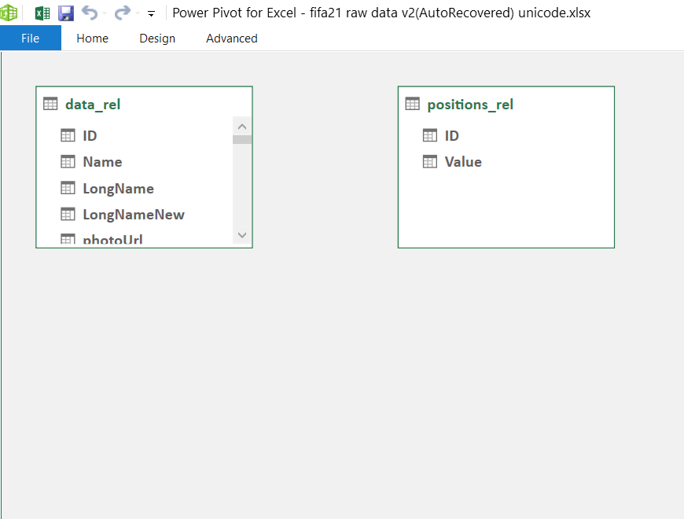 | 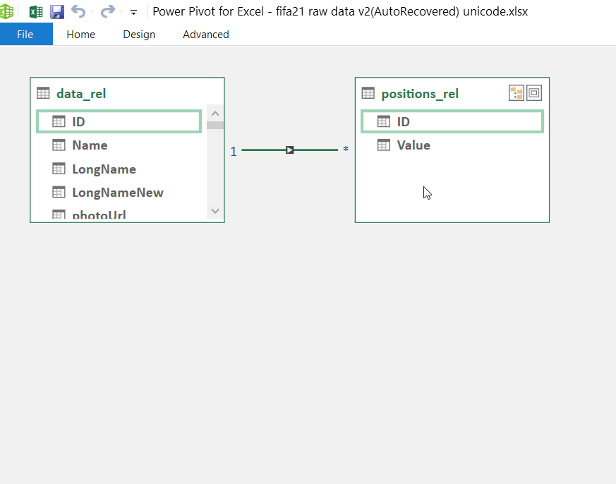 | 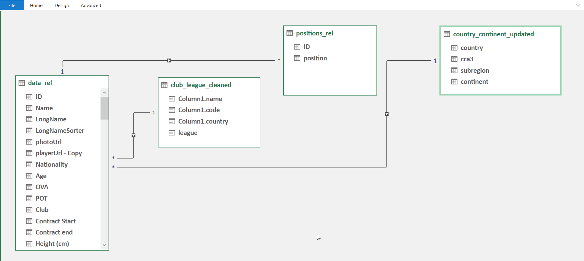

The model is a star schema.

I had one fact table (position_rel), one fact/dimension table (data_rel) and two dimension table (clubs_leagues_cleaned and country_continent_updated).

Asides from the major transformations carried out in [cleaning the dataset](https://github.com/nwashilia/fifa-21-data-cleaning/blob/main/README.md), I carried out some additional transformation to create some necessary columns (**CA** to **CJ** in the image below) for the analysis I sought to carry out.

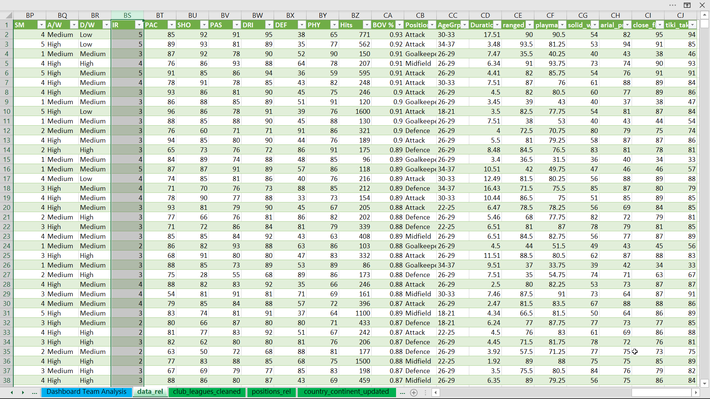

## Visualisation

This report comprises of two pages:
1. Dashboard Main
2. Dashboard Team Analysis

## Analysis

### Dashboard Main

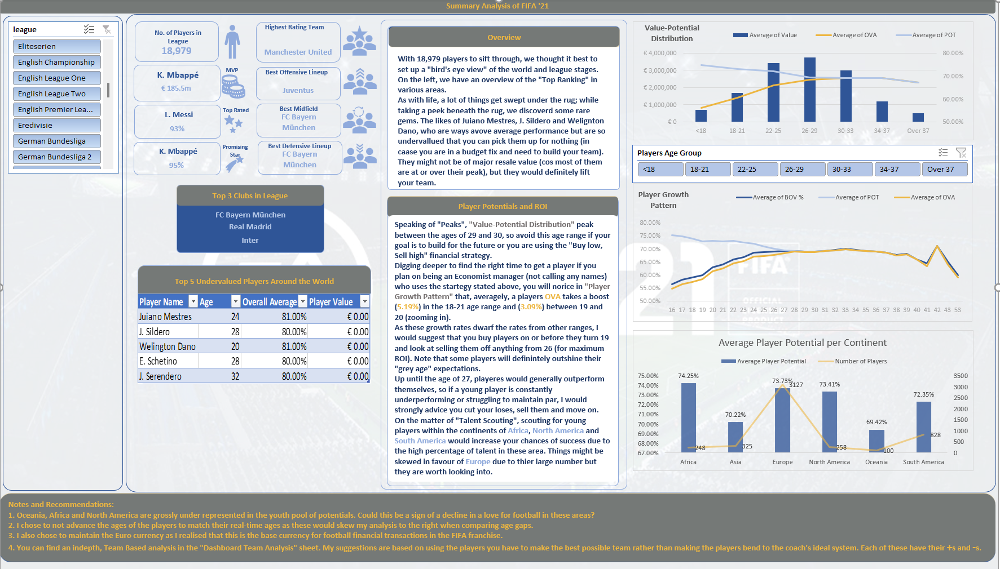
Overall view of Main Dashboard

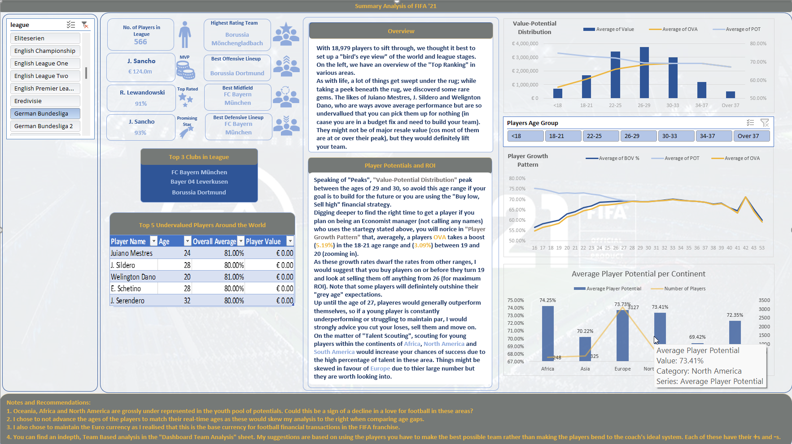
Bundesliga view of the Main Dashboard

#### KPIs
With a total of 18,979 players in the database (and also considered as the world in this analysis), it will be noted that *the most valuable player* is **K. Mbappe**, *Top Rated Player* is **L. Messi**, *Promising Star* is **K. Mbappe**, *Highest Rated Team* is **Manchester United**, *Best Offensive Lineup* is **Juventus**, *Best Midfield* is **FC Bayern Munchen** and *Best Defensive Lineup* is also **FC Bayern Munchen**.
This data is for the world level view but changes as we begin to dive into the leagues.
We also have a listing of the **Top 3 Clubs** in the world should you want to go down the route of starting your journey on the strongest foot possible; you have the chance to pick from the likes of **FC Bayern Munchen**, **Real Madrid** and **Inter**.

#### Finding Gold in the Dust
With some digging around (using a scatter plot), I realised that not all players were valued at their actual worth. These could be for various reasons (the indicator pointer being age). ☹️
This is a huge goldmine as out of the top 5 undervalued players, only one is above the age of 30 and all in the top 5 undervalued are valued at €0; this is like going out thrift shopping and coming home with a painting in the class of Van Gogh's works.
It would be very wise to buy these players and use them to climb to the zenith, you might not get awesome resale value for these players as they have all peaked in their career journey, but you'll definitely save a whole lot to gain a whole lot more 💶.

#### Acquire, Groom and Boom 💰💰💰
What are the major factors that affects a players value in the market you ask?
_Age_, _Overall rating_ and _Potential rating_.
I noticed a strong negative correlation between age and the OVA-POT ratio, as a player gets older, the OVA-POT (Average rating-Potential rating) ration reduces until about the age of 28 where the ratio is roughly a 1:1 from then onwards. Save for a jump by some Goalkeepers at the age of 42 (which isn't so unexpected), it is a slow decline to retirement.

Looking further into the data, the best time to look into buying players with huge potential and hopes of the biggest possible ROI would be before they turn 19. clearly their growth rate is massive with players growing roughly 5.19% between the ages of 18 and 21 ( a closer look at the 19 year olds show that they hold the chunk of the growth listed above with about 3.09% growth by the time they get to 20).

Overall | <18 | 18-21 | 22-25 | 26-29 | 30-33 | 34-37 | Over 37
:-----------------------:|:--------------:|:--------------:|:--------------:|:--------------:|:--------------:|:--------------:|:--------------:
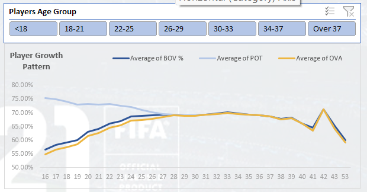 | 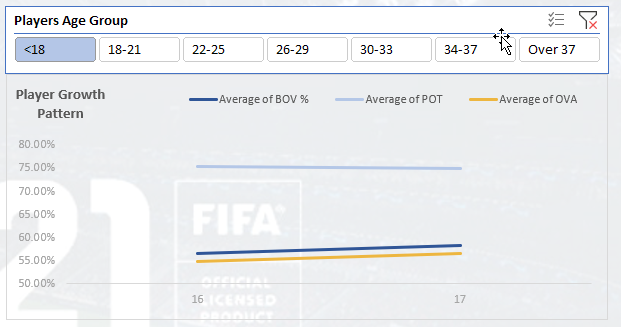 | 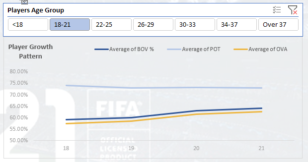 | 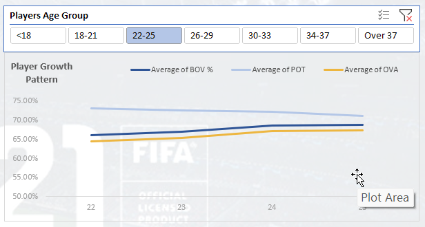 | 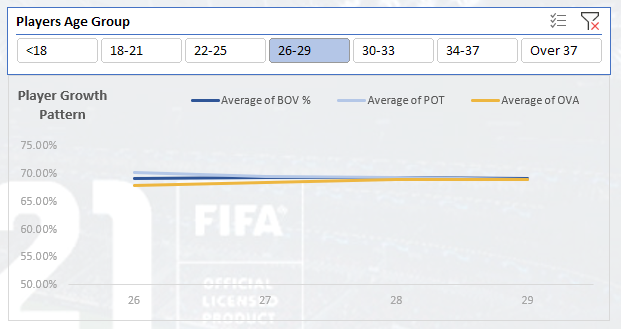 | 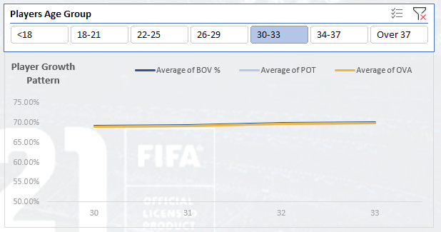 | 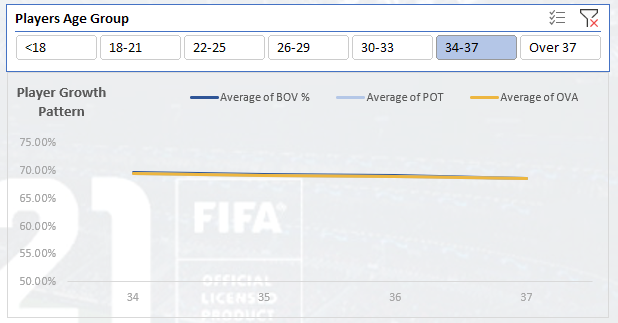 | 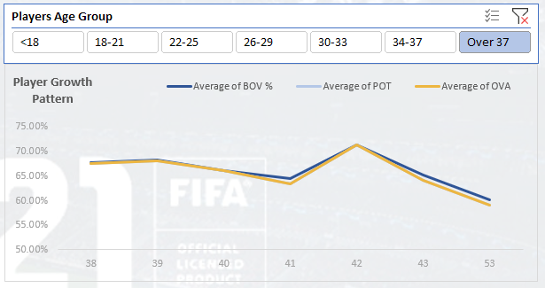

So **pick 'em** young, **groom** them till about the age of 26, which is just before they hit their peak and begin the ultimate decline, and sell them off for a **Boom** in your cash flow.

#### Talent Hunt
For the talent-hungry, tomorrow-minded managers out there, who use the scouting system 🔎🔎 to the fullest, here's a little something for you.
Based on the numbers and patterns created, your best bet for getting talent at lesser cost and waste of time in scouting missions would be to scout the following continents with young talents in mind:
- Africa (with Averages of 74.25% on POT)
- North America (73.41% on POT)
- South America (72.35% on POT)
It is also worth while to look into Europe, they also have a pool of 73.73% on POT but weren't listed among the top three as this number was generated from a massive population of 3,127 young players which dwarfs even South America's 828 players.

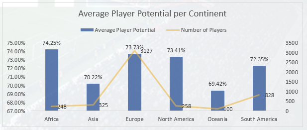

### Dashboard Team Analysis

[Picture here]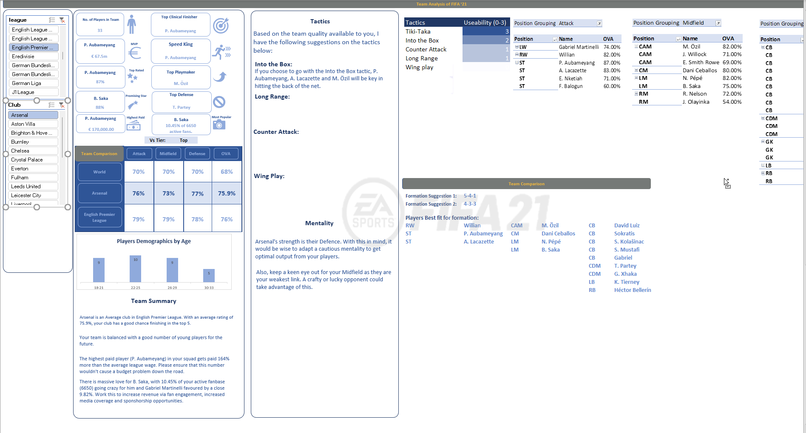

#### You got a team now, But how good are they?
The **Team Comparison** section allows you to compare the various sections of your team (Attack, Midfield and Defence) and your complete team in general against those of other teams in your league and against those in the world, should you qualify for continental championships like the UEFA Champion's league.
You can compare your club to the league and world clubs on the basis of **Top tier** (the best), **Middle tier** (the middle or average guys) and the **Bottom tier** (the struggling teams).

This allows you to quickly weigh your odds and set your season goals, for example, if you rate below the Bottom tier clubs, it wouldn't be wise to set a goal of winning the league if you haven't acquired better players than your present squad.

#### KPIs in a Snap
You get a quick overview of the biggest individual advantages you have on your team at the top left of the dashboard showing you whom your **best clinical striker** is, your **Speed king**, **Playmaker** and **Best defensive player**.
I had to create columns that would handle these attributes for these players as no single attribute in the original dataset could handle this efficiently. Examples in the next section.

#### Tactic, Tactic, Tiki-Taka
Using five major football attacking tactics (Wing Play, Counter Attack, Into the Box, Tiki-Taka and Long range), I created an algorithm that automatically suggests which of these tactics your team can pull off and how effortlessly (0-3) they can pull it off depending on the skill attributes of players in your squad. It is team dependent.
I needed to create custom columns that were used to run the algorithm.

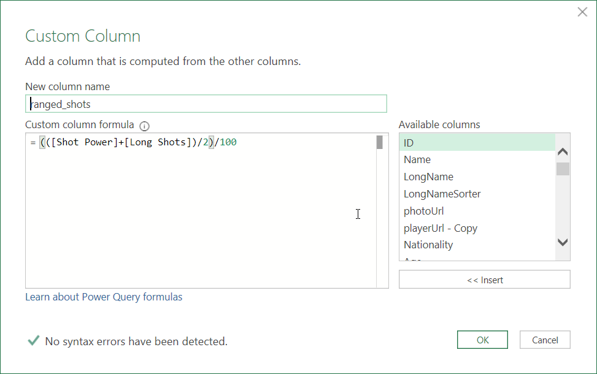
Ranged Shots column

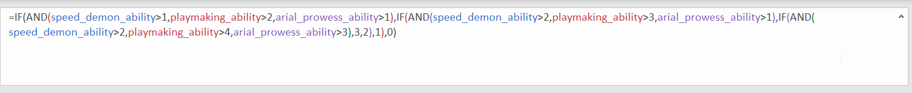
Wing play algorithm

These columns were based off of research on the original data source [www.sofifa.com](https://sofifa.com).

#### Formation, Mentality and Best Fit
I also had to create algorithms that generated the best fitting formation for the team while also using their strengths and weaknesses to suggest optimal mentalities for the team while considering only your top tier players for this task, which is in line with the "Use your strengths, protect your weaknesses" approach.

## Conclusion, Notes and Recommendations

All in all, this was a fun, tasking and amazingly invigorating analysis. Thank you Chinonso ([@PromiseNonso_](https://twitter.com/PromiseNonso_)) and V. Somadina ([@VicSomadina](https://twitter.com/VicSomadina)) for providing us with this dataset and the task. I look forward to tackiling this data set again while making some improvements on it.
I am definitely open to suggestions and critique, you can reach out on my socials [Twitter](https://twitter.com/emmanwashili) or [LinkedIn](https://www.linkedin.com/in/emmanuel-nwashili-7051097b).

Also, I would love to hear from FIFA franchise fans as how this could be helpful to in game.
Hope to hear from you.

### Notes
I chose to not advance the ages of the players to match their real-time ages as these would skew my analysis to the right when comparing age gaps.
I also chose to maintain the Euro currency as I realised that this is the base currency for football financial transactions in the FIFA franchise.

Oceania, Africa and North America are grossly under represented in the youth pool of potentials. Could this be a sign of a decline in a love for football in these areas?
### Recommendation
1. I would recommend you use the advice given on the dashboards as a foundation to build your own team. You would do so many amazing things, with less bottlenecks.

## Attributions
Extra datasets were sourced from other sources to make this analysis possible.
- Countries and Continents Data: [List of Countries by Continent 2023 (worldpopulationreview.com)](https://worldpopulationreview.com/country-rankings/list-of-countries-by-continent)
- World leagues data: [GitHub - openfootball/football.json](https://github.com/openfootball/football.json)
